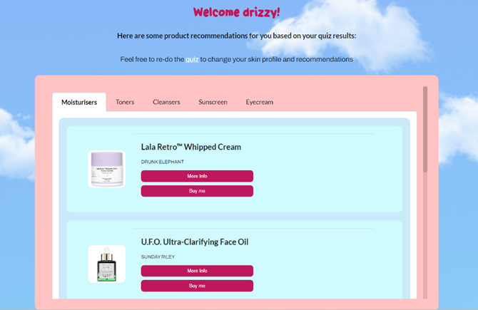
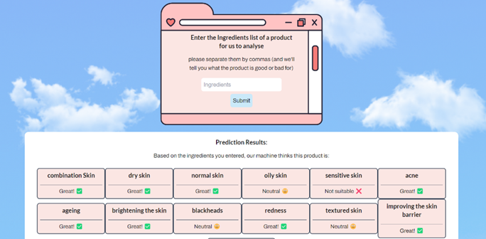

# Skin Deep: a skincare product recommendation web app
### available at https://skindeepfyp.netlify.app/

## The aim of this project was to create a web app for those new to skin care to learn about their own skin and products/ingredients that would suit them. Cosmetic companies employ a lot of deceptive marketing tactics particularly targetting young girls who may not know what products would actually be suitable for them. There are many many products being recommended by influencers as miracle products but everyones skin is different and it can be hard to know what to buy sometimes. This project aims to bring some clarity and transparency to that process. 

# This project has two main features:
## A content based skincare product recommendation algorithm 
 
### Based on cosmetic ingredient research this product recommender creates a skin profile for a user based on a quiz, assigns weights to relevant skin concerns that products may suit and creates a score for each product in the database. The highest scored products get recommended to users ensuring that ingredients were the only factor involved in the recommendation.

## A product analyser AI model

### Paste in an ingredients list from any cosmetic product and the AI model (random forest classifier) will predict the uses of each product.